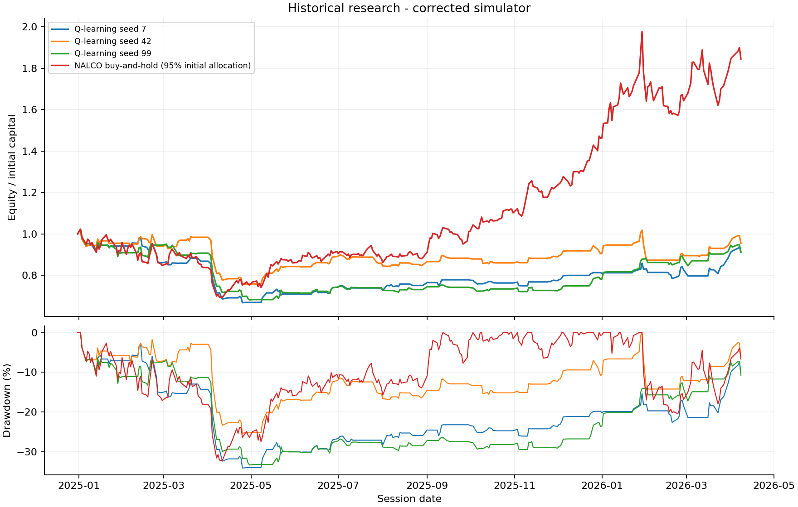

# NALCO Aluminium Market Research

**Availability-aware financial research and a tested Q-learning backtesting engine.**

By [Vidhan Doshi](https://github.com/Vidhan615) · Python · Pandas · NumPy · Matplotlib

This project investigates how NALCO stock returns relate to aluminium prices,
the dollar index and Chinese aluminium equities. It combines descriptive return
analysis, chronological prediction baselines and tabular reinforcement-learning
experiments. A shared portfolio simulator handles execution timing, cash,
trading costs, monthly accounting and restricted intraday long/short experiments.

**Status:** research prototype. Corrected historical experiments do **not**
establish a profitable trading edge. Source-data issues remain documented.
The repository includes a runnable synthetic example; private historical CSVs
are not needed to try the software.



## What is implemented

- Strict loaders for canonical, Investing.com and prefixed external-price CSVs.
- Causal RSI, MACD, Bollinger, ATR and corrected Supertrend features.
- Close-time decisions with following-session open fills, integer shares,
  residual cash, adverse slippage and explicit per-fill fees.
- Portfolio-aware tabular Q-learning with seeded training and saved Q-tables.
- Calendar-month return accounting and an optional monthly-target rule.
- Prior-session signals for next-open/same-close intraday long/short experiments.
- Optional multi-asset selection through one shared portfolio policy.
- Strictly earlier external-price alignment, source-age checks and ridge baselines.
- Multiple seeds, annual expanding-training baselines, cost sensitivity,
  cash-ledger reconciliation and regression tests.

## Run the public example

Python 3.11 or 3.12 is recommended. From the repository root:

```bash
python -m venv .venv
```

Activate the environment:

```powershell
# Windows PowerShell
.\.venv\Scripts\Activate.ps1
```

```bash
# macOS / Linux
source .venv/bin/activate
```

Install and run:

```bash
python -m pip install -r requirements-dev.txt
python -m pytest -q
python run.py demo --episodes 3 --seeds 42
```

The quick example uses **fictional prices**, not NALCO market history. Its small
episode count is a smoke test, not an investment result. Output appears in
`results/demo/`. For the full demo use `python run.py demo` (200 episodes per
seed; runtime depends on the computer).

The package can optionally be installed with `python -m pip install -e .` to use
the `nalco-research` command. The documented `run.py` commands work directly
from a checkout without an editable install.

## Corrected historical results

Execution window: **1 January 2025 - 8 April 2026**, 314 sessions. Training ends
on 31 December 2024. Capital: INR 500,000; 95% allocation; per-fill fee 10 bps
and slippage 5 bps. All three seeds are reported; none is selected for favourable
performance. This period was already examined in the original project and is
a reused historical evaluation window, not an untouched final deployment test.

| Experiment | Seed 7 return | Seed 42 return | Seed 99 return |
|---|---:|---:|---:|
| Long-only Q-learning | -8.72% | -4.52% | -8.75% |
| Monthly 5% target rule | -13.24% | +2.41% | -2.56% |
| Intraday long/short | -39.43% | -43.34% | -42.92% |
| Q-learning with external return signs | -0.56% | -3.27% | -3.27% |

Matching NALCO buy-and-hold with the same 95% initial allocation and costs
returned **84.49%**, with **32.20%** maximum drawdown. Long-only Q-learning's
maximum drawdowns were 34.09%, 25.31% and 33.34% for seeds 7, 42 and 99.
External-feature Q policies were mostly in cash; low drawdown is therefore not
evidence of superior forecasting. Intraday and buy-and-hold have different
overnight exposure. These are price-only results conditional on unverified
supplied data, not dividend-adjusted total returns or complete broker net returns.

The continuous external-feature ridge baseline reached **55.73% direction
accuracy** on next-session open-to-close returns, versus **51.91% always-up**,
but its **2.325 percentage-point RMSE** was worse than the zero-return baseline's
**2.306**. Accuracy alone does not establish useful return forecasts or trading
profit. Annual forward evaluations likewise do not show consistent improvement.

The fixed seed-42 long-only policy returned -1.64% at zero costs, -4.52% at the
base costs, -17.69% at 20/10 bps fee/slippage and -35.40% at 40/20 bps. Cost changes
can change portfolio-state buckets and therefore actions; this is a fixed-policy
evaluation, not a fixed-trade arithmetic fee subtraction or retraining per cost.

Full metrics, trades, monthly tables, models and source fingerprints:
[long-only](results/historical/long_only/),
[monthly target](results/historical/monthly_5pct/),
[intraday](results/historical/intraday/),
[external inputs](results/historical/external/),
[annual forward baselines](results/historical/annual_forward_baselines.csv),
[cost sensitivity](results/historical/fixed_policy_cost_sensitivity.csv).

## Reproduce with local historical data

Read [data requirements and unresolved provenance](data/README.md) first. Raw
market CSVs are excluded from Git; only synthetic example prices are bundled.

```bash
python run.py run --data data/raw/nalco_daily.csv --output results/local/long_only
python run.py run --data data/raw/nalco_daily.csv --monthly-target 0.05 --output results/local/monthly
python run.py run --data data/raw/nalco_daily.csv --intraday --output results/local/intraday
```

External-input experiment (single-line command, also works in PowerShell):

```bash
python run.py run --data data/raw/nalco_daily.csv --external LME=data/raw/lme.csv --external DXY=data/raw/dxy.csv --external HONGQIAO=data/raw/hongqiao.csv --external CHALCO=data/raw/chalco.csv --output results/local/external
```

Reproduce all published runs and diagnostics, then verify their ledgers:

```bash
python scripts/reproduce_historical.py --data-dir data/raw --output results/local/reproduced
python scripts/verify_results.py results/local/reproduced
```

Use `--asset VEDANTA=data/raw/vedanta.csv` for an additional equity. Every asset
must have a complete matching calendar after warm-up. The supplied Hindalco
file fails strict validation because January 2026 OHLC values are missing; no
corrected Hindalco result is claimed. Optional arguments include `--test-start`,
`--test-end`, `--seeds`, `--episodes`, `--fee-bps` and `--slippage-bps`.

## Original audit and corrections

The project began as several independent trading experiments. An audit found
indicator, execution, monthly-accounting and short-timing defects. This repository
replaces those duplicated engines with one tested implementation. Original source
files/reports remain preserved locally; the public repository retains selected
[original audit evidence](results/original-audit/) and its
[legacy analysis](docs/legacy/original-project-analysis.md).

Original figures, including a 58.20% strategy return and a Sharpe above 1.4 in
one saved simulation, do not describe the corrected implementation. They must
not be reused as validated current model performance.

Read [methodology](docs/methodology.md) for timing, labels, states and accounting;
[known limitations](docs/known-limitations.md) for corrected defects and remaining
data/model assumptions. LME OHLC inconsistencies and missing Hindalco prices
require verified source data; they are not repaired by inventing observations.

## Repository layout

```text
src/nalco_research/   loaders, indicators, portfolio simulator, agents, baselines, CLI
scripts/             synthetic generator, full reproduction, independent ledger checks
tests/               financial accounting, timing, causality and reproducibility tests
data/sample/         deterministic fictional OHLCV
data/README.md       schemas, source requirements and raw-data policy
docs/                methodology, limitations and legacy audit
results/historical/  corrected runs and diagnostics
results/original-audit/ selected original findings, separately labelled
.github/workflows/   tests and synthetic smoke run on Python 3.11/3.12
```

## Next research steps

Verify instruments, source timestamps, exchange calendars and corporate actions;
recover missing equity prices; evaluate fresh chronological periods; investigate
state sparsity and broader market controls. Add live feeds or broker integration
only as a separately tested engineering extension. This repository currently
provides offline research and simulated execution.

Source code and synthetic example: [MIT License](LICENSE). Third-party data
rights are not granted by this license.
